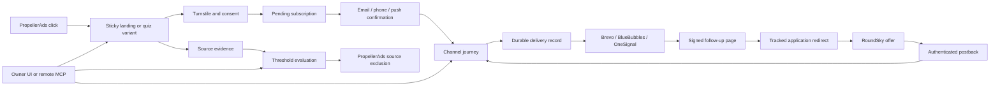

# Architecture and operating limits

## Request and event flow

The web process serves the React application, authenticated owner API, public visitor API, webhooks, and MCP. A separate process evaluates due enrollments and source rules every 30 seconds. The worker acquires a PostgreSQL advisory lock. Send intent is committed before calling an external provider. Crashed or ambiguous attempts become `UNCERTAIN`, preventing automatic resend until an owner checks the provider logs.

## Attribution and outcomes

A visit keeps the assigned variant and rendered configuration snapshot. This preserves exact consent wording even after a variant is edited. A lead references its acquisition visit; each outbound offer click receives a distinct application UUID in RoundSky's `subId3`. The native pixel returns it as `hid`. Campaign and source zone populate `subId` and `subId2`. The original source and variant remain attributable even when a later follow-up generated the application.

`SOLD`, `APPROVED`, and `FUNDED` are separate statuses. The supplied RoundSky pixel reports only `SOLD`, with commission and a transaction ID; it does not establish loan approval or funding. Their update order is monotonic; late, less advanced events do not downgrade a funded record. Revenue events are deduplicated by event ID; native sale keys use `roundsky:sold:<transactionId>`, and conflicting retries are rejected. Lead stages and application-level conversion counts are separate concepts. A person may have several channel subscriptions or several application attempts.

Reports currently show all-time experiment performance, active confirmed subscription counts, and unique converted application IDs. These are descriptive metrics. They are not randomized-experiment significance tests, lifetime unique-customer counts, or provider-reconciled profit reports. Unsubscribing reduces the active-subscription objective count.

## Journeys

Confirmation enrolls a channel in its active subscription chain. An eligible event can switch that channel to a matching active branch and cancel its pending messages. Each subscription can enter a particular chain once. Journeys stop on channel opt-out, the configured success stage, or their maximum age. The default success stage is `SOLD`, matching the current RoundSky pixel; a sale stops all the person's channels. Each channel has a rolling 24-hour send cap; no aggregate cross-channel cap is currently enforced.

Sending windows use the lead's stored IANA time zone by default. Detection can prefer browser or trusted Cloudflare IP location, then uses the other source, then the configured workspace fallback. The owner can override a lead's zone in the CRM or MCP, or choose workspace mode for all recipients. Source provenance is recorded; older records are marked `UNKNOWN` without changing their existing zones. Detection-priority changes apply to new subscriptions. Fallback-derived records use the current workspace zone at send time. CRM timestamps still display in the owner's browser time zone; these settings control message scheduling.

All channels use the same configured local sending window. IANA conversion handles daylight saving and regions without it. Step delays and the rolling cap remain elapsed hours: a 24-hour cap may shift delivery by an hour across spring daylight saving. Due jobs outside their window receive a separate `deferredUntil` timestamp, preserving their step's original due time and allowing later eligible recipients to run. Changing an owner's timing settings or a contact's zone clears affected deferrals. The worker rechecks the latest zone and sending window before dispatch. Messages already accepted by providers cannot be rescheduled.

GET requests to follow-up URLs do not record engagement or switch chains. Only the explicit continuation button records a click-through, reducing false branching from email security scanners. The first link-open and confirmed click-through are therefore not equivalent metrics.

Provider acceptance is not a delivery/read guarantee. Live provider checks and account-specific webhook payload verification remain part of deployment setup.

## Application configuration

`DATABASE_URL` and `OWNER_PASSWORD` are the required operator environment variables. `AppConfiguration` stores public connection settings and provider credentials directly in PostgreSQL. There is no encryption key file, required app volume, or public first-user registration. Database backups contain provider credentials and must be kept private.

Initialization uses a database advisory lock to serialize web/worker startup. It stores a bcrypt verifier of `OWNER_PASSWORD` and random access/tracking tokens. A changed environment password updates the verifier and revokes owner sessions; it cannot be changed through Settings or MCP. Web and worker must use the same environment password. No bootstrap password file is generated.

An additive migration keeps the previous encrypted bundle for backup. If an old key is available during first upgrade, its credentials migrate unchanged. If it is unavailable or cannot decrypt the bundle, initialization resets only credentials, regenerates access/tracking tokens, revokes sessions, disables live delivery/source exclusions, and records an audit and a Settings notice. CRM data, campaigns, and public configuration are preserved. The owner reconnects providers and updates callbacks/MCP and old signed links. Subsequent restarts use database credentials only; malformed new-format credentials fail validation instead of silently resetting.

Each HTTP request and worker cycle loads a fresh configuration snapshot into AsyncLocalStorage. This prevents concurrent requests from mixing credentials during settings updates. Saved changes affect new requests and cycles; an in-flight provider call cannot be recalled. Connection updates use a row lock, patch semantics, and an audit containing changed field names only. Owner reads return configuration flags for secrets, with a separate audited reveal action; plaintext credentials and password hashes are excluded from dashboards, MCP responses, and audits. Test configuration is isolated from the development database.

## Security and durability

- Owner password is bcrypt-hashed; opaque session tokens are stored as hashes, expire after 12 hours, and use HttpOnly, SameSite cookies. Production cookies require HTTPS.
- Browser owner writes require the configured origin. MCP uses a separate long bearer token, origin checks, and write audit records.
- Webhooks require a secret. RoundSky's native sold-lead endpoint uses a separate scoped secret; its pixel URL is exposed only through a non-cached owner endpoint. Unknown event fields are discarded; no SSNs, bank details, or full lender applications are collected.
- Visit, confirmation, preference, and tracked-link tokens are HMAC-signed and expire. Raw IP addresses are not stored; IP hashes support abuse evidence.
- Unique database keys protect against duplicate postbacks, duplicate subscription addresses, and duplicate enrollment-step records.
- Provider errors exclude raw response bodies and credentials. Source changes are additive and audit logged.
- Public data such as names, notes, and quiz answers are treated as untrusted by MCP instructions; external AI clients must preserve that boundary.

Suppression is rechecked before dispatch and queued work is cancelled. A message already accepted by a provider cannot be recalled; an unsubscribe arriving during an in-flight provider call may race with that final send. Exactly-once delivery cannot be guaranteed for transports without idempotency support. BlueBubbles and Brevo ambiguous sends are held, not auto-retried.

## Initial-version boundaries

- RoundSky uses the supplied self-optimizing hosted link and sold-lead S2S pixel. Approval/funding/decline need separately verified events. Direct API application intake and embedded forms are not implemented.
- Brevo per-recipient lists/campaigns suit an initial small deployment; batch marketing operations are needed before large-scale traffic.
- OneSignal external-ID association is checked, but account-side JWT identity verification is not configured by this application.
- HTTP rate limits are process-local. Use a shared store for multiple web replicas and establish trusted proxy ranges for your actual network.
- Source attribution parameters are not authenticated by PropellerAds. Cross-check advertiser reporting before trusting automated paid-source changes. No automatic unblock/retest, bid optimization, cost reconciliation, or subzone management yet.
- Traffic qualification focuses on subscription submissions. Sophisticated bots that pass challenges, or bots that never interact with forms, may remain undetected.
- Time-based branching does not imply lender rejection. Credit-repair offers remain unconfigured.
- There is no built-in OAuth authorization server, data-retention scheduler, provider spend importer, or legal-policy generator. Add business-specific retention and deletion procedures before collecting production contacts.
- Outbound network operations have timeouts; ambiguous send failures need owner reconciliation. Financial reversals are not modeled.

Back up PostgreSQL and retain the hosting environment configuration, monitor the worker heartbeat (`Setting.workerHeartbeat`), and review delivery failures. Provider secrets are managed in owner Settings and do not belong in the repository.
